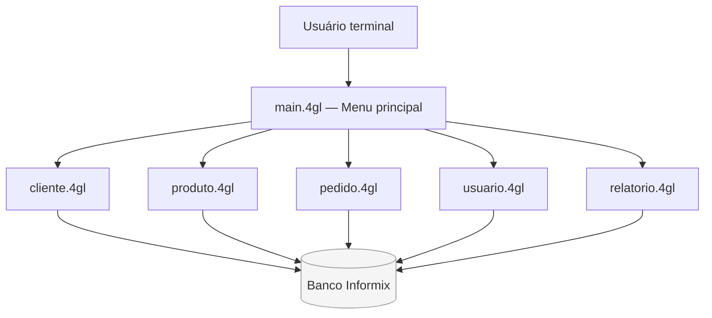
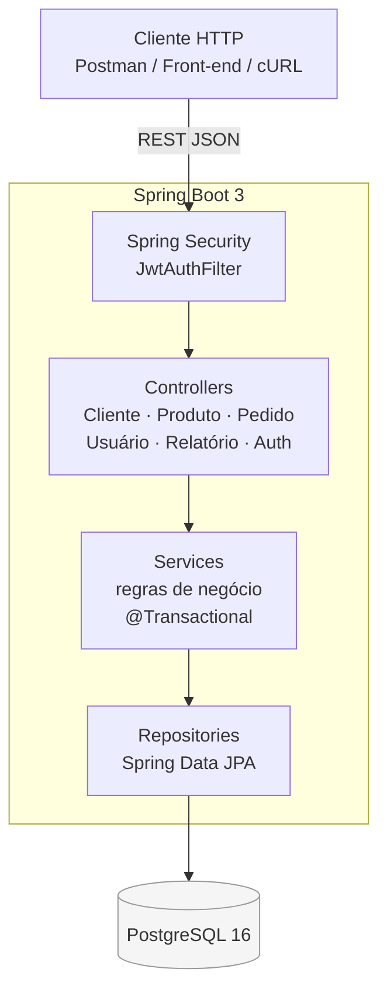
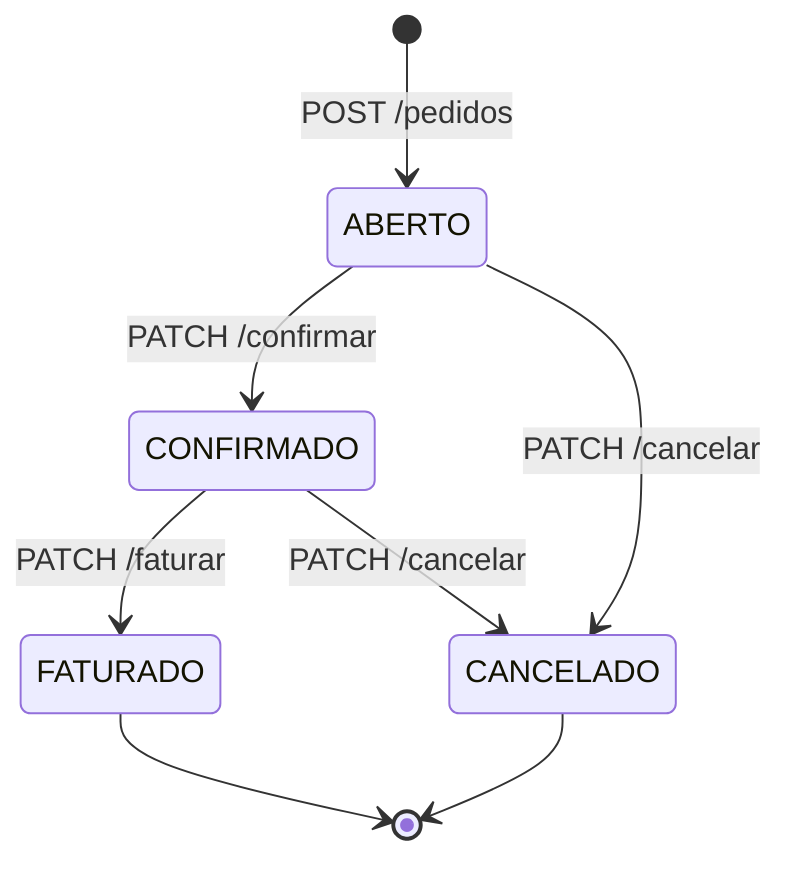

# Arquitetura — Antes e Depois

## Legado (Informix-4GL)

O sistema é uma aplicação TUI escrita em Informix-4GL. Menu principal em
`main.4gl`; cada módulo concentra navegação, validação, regra de negócio e
SQL embutido num único arquivo `.4gl`. As telas são formulários `.PER`
compilados separadamente.

### Diagrama legado



Características:
- Interface de texto dirigida por menus.
- Cada módulo concentra navegação, validação, regra de negócio e SQL.
- Formulários PER definem a apresentação e a entrada de dados.
- Pedidos possuem cabeçalho (`pedido`) e itens (`item_pedido`); o total é
  recalculado por `pedido_recalcular_total()` após a inclusão dos itens.

---

## Modernizado (Spring Boot 3)

A aplicação foi separada em camadas seguindo Clean Architecture:



### Máquina de estados do Pedido



---

## Schema de Banco (compatível Informix → PostgreSQL)

```
usuario ──┐
           │ FK usuario_id
cliente ──┐│
           ││ FK cliente_id
           ▼▼
         pedido ◄──── item_pedido ──► produto
```

Tabelas: `usuario`, `cliente`, `produto`, `pedido`, `item_pedido`
